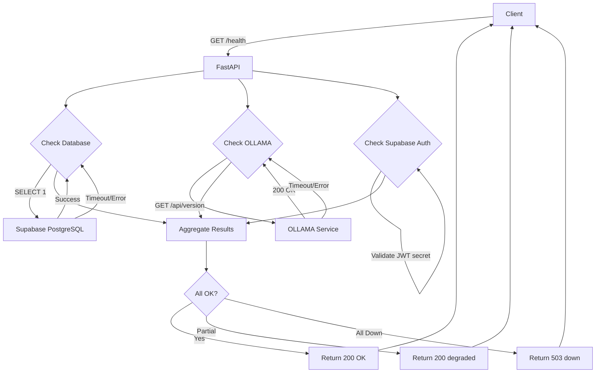
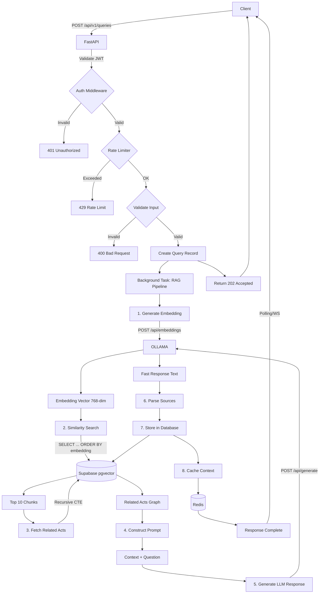

# Kompleksowy Plan Implementacji API – PrawnikGPT

**Wersja:** 1.0 (MVP)  
**Data utworzenia:** 2025-11-19  
**Autor:** AI Architecture Assistant  
**Tech Stack:** FastAPI (Python 3.11+), Supabase (PostgreSQL + pgvector), OLLAMA

---

## Spis Treści

1. [GET /health](#1-get-health---health-check)
2. [POST /api/v1/queries](#2-post-apiv1queries---submit-query)
3. [GET /api/v1/queries](#3-get-apiv1queries---list-queries)
4. [GET /api/v1/queries/{query_id}](#4-get-apiv1queriesquery_id---get-query-details)
5. [DELETE /api/v1/queries/{query_id}](#5-delete-apiv1queriesquery_id---delete-query)
6. [POST /api/v1/queries/{query_id}/accurate-response](#6-post-apiv1queriesquery_idaccurate-response---request-accurate-response)
7. [POST /api/v1/queries/{query_id}/ratings](#7-post-apiv1queriesquery_idratings---create-or-update-rating)
8. [GET /api/v1/queries/{query_id}/ratings](#8-get-apiv1queriesquery_idratings---get-ratings)
9. [DELETE /api/v1/ratings/{rating_id}](#9-delete-apiv1ratingsrating_id---delete-rating)
10. [GET /api/v1/legal-acts](#10-get-apiv1legal-acts---list-legal-acts)
11. [GET /api/v1/legal-acts/{act_id}](#11-get-apiv1legal-actsact_id---get-legal-act-details)
12. [GET /api/v1/legal-acts/{act_id}/relations](#12-get-apiv1legal-actsact_idrelations---get-legal-act-relations)
13. [GET /api/v1/onboarding/example-questions](#13-get-apiv1onboardingexample-questions---get-example-questions)

---

# 1. GET /health - Health Check

## 1.1. Przegląd punktu końcowego

Endpoint monitorujący dostępność i stan systemu. Sprawdza połączenia z kluczowymi serwisami (Supabase, OLLAMA, Supabase Auth) i zwraca ich status. Używany przez systemy monitoringu, load balancery i DevOps do health checks.

**Charakterystyka:**
- **Publiczny** (bez autentykacji)
- **Wysoka dostępność** (musi działać nawet przy częściowej awarii)
- **Szybki** (<100ms)
- **Idempotentny**

---

## 1.2. Szczegóły żądania

- **Metoda HTTP:** `GET`
- **Struktura URL:** `/health`
- **Parametry:**
  - Wymagane: Brak
  - Opcjonalne: Brak
- **Request Body:** Brak
- **Headers:** Brak wymaganych

**Przykład wywołania:**
```bash
curl http://localhost:8000/health
```

---

## 1.3. Wykorzystywane typy

### Pydantic Models (Backend)

```python
# backend/models/health.py
from pydantic import BaseModel
from typing import Literal
from datetime import datetime

ServiceStatus = Literal["ok", "degraded", "down"]

class ServiceHealthStatus(BaseModel):
    database: ServiceStatus
    ollama: ServiceStatus
    supabase_auth: ServiceStatus

class HealthResponse(BaseModel):
    status: ServiceStatus  # Overall system status
    version: str
    timestamp: datetime
    services: ServiceHealthStatus
```

### TypeScript Types (Frontend)

```typescript
// src/lib/types.ts (already defined)
export type ServiceStatus = "ok" | "degraded" | "down";

export interface HealthResponse {
  status: ServiceStatus;
  version: string;
  timestamp: string;
  services: {
    database: ServiceStatus;
    ollama: ServiceStatus;
    supabase_auth: ServiceStatus;
  };
}
```

---

## 1.4. Szczegóły odpowiedzi

### Sukces (200 OK)

```json
{
  "status": "ok",
  "version": "1.0.0",
  "timestamp": "2025-11-19T10:30:00Z",
  "services": {
    "database": "ok",
    "ollama": "ok",
    "supabase_auth": "ok"
  }
}
```

### Częściowa degradacja (200 OK - nadal działa)

```json
{
  "status": "degraded",
  "version": "1.0.0",
  "timestamp": "2025-11-19T10:30:00Z",
  "services": {
    "database": "ok",
    "ollama": "down",
    "supabase_auth": "ok"
  }
}
```

### Całkowita awaria (503 Service Unavailable)

```json
{
  "status": "down",
  "version": "1.0.0",
  "timestamp": "2025-11-19T10:30:00Z",
  "services": {
    "database": "down",
    "ollama": "down",
    "supabase_auth": "down"
  }
}
```

**Status codes:**
- `200 OK` - System działa (ok lub degraded)
- `503 Service Unavailable` - System nie działa (down)

---

## 1.5. Przepływ danych



**Szczegółowy przepływ:**

1. **Request received** → FastAPI odbiera żądanie GET /health
2. **Parallel checks** → Asynchroniczne sprawdzanie wszystkich serwisów:
   - **Database check:** `SELECT 1` query (timeout 2s)
   - **OLLAMA check:** `GET /api/version` (timeout 2s)
   - **Supabase Auth check:** Walidacja JWT_SECRET (local, instant)
3. **Aggregate results** → Zbieranie wyników wszystkich checków
4. **Determine overall status:**
   - Wszystkie `ok` → status: `ok`
   - Przynajmniej jeden `down` ale nie wszystkie → status: `degraded`
   - Wszystkie `down` → status: `down`
5. **Return response** → 200 OK (ok/degraded) lub 503 (down)

---

## 1.6. Względy bezpieczeństwa

### Autentykacja i Autoryzacja
- **Brak autentykacji** - endpoint publiczny
- **Uzasadnienie:** Health checks muszą działać bez logowania dla load balancerów

### Potencjalne zagrożenia i zabezpieczenia

1. **Information Disclosure:**
   - **Zagrożenie:** Ujawnienie szczegółów infrastruktury (wersje, nazwy serwisów)
   - **Mitygacja:** 
     - Nie zwracaj szczegółowych wersji serwisów
     - Nie ujawniaj adresów IP/hostów
     - Ogranicz informacje w środowisku produkcyjnym

2. **DDoS Attack Vector:**
   - **Zagrożenie:** Endpoint może być używany do DDoS (sprawdzanie serwisów)
   - **Mitygacja:**
     - Rate limiting: 60 req/min per IP
     - Krótkie timeouty (2s) dla checków
     - Caching wyników (5s TTL)

3. **Timing Attacks:**
   - **Zagrożenie:** Analiza czasu odpowiedzi może ujawnić stan systemu
   - **Mitygacja:** Równoczesne sprawdzanie wszystkich serwisów (asyncio.gather)

### Zalecenia bezpieczeństwa

```python
# Produkcja: ograniczone informacje
if settings.environment == "production":
    # Nie zwracaj szczegółowych błędów
    return HealthResponse(
        status="ok" if all_services_ok else "degraded",
        version="1.0",  # Bez szczegółowej wersji
        timestamp=now(),
        services={
            "database": "ok" if db_ok else "degraded",
            "ollama": "ok" if ollama_ok else "degraded",
            "supabase_auth": "ok"
        }
    )
```

---

## 1.7. Obsługa błędów

### Scenariusze błędów

| Scenariusz | Status Code | Response | Akcja |
|------------|-------------|----------|-------|
| Wszystkie serwisy działają | 200 OK | status: "ok" | Brak akcji |
| OLLAMA nie odpowiada | 200 OK | status: "degraded", ollama: "down" | Alert dla DevOps |
| Database timeout | 200 OK | status: "degraded", database: "down" | Alert CRITICAL |
| Wszystkie serwisy down | 503 Service Unavailable | status: "down" | Alert CRITICAL + Incident |
| Nieoczekiwany błąd wewnętrzny | 500 Internal Server Error | Standard error response | Log błędu + Alert |

### Implementacja obsługi błędów

```python
async def check_service_health(
    service_name: str,
    check_func: Callable,
    timeout: float = 2.0
) -> ServiceStatus:
    """
    Generic service health checker with timeout.
    
    Args:
        service_name: Name for logging
        check_func: Async function to check service
        timeout: Timeout in seconds
        
    Returns:
        ServiceStatus: "ok" or "down"
    """
    try:
        await asyncio.wait_for(check_func(), timeout=timeout)
        logger.info(f"{service_name} health check: OK")
        return "ok"
    except asyncio.TimeoutError:
        logger.warning(f"{service_name} health check: TIMEOUT")
        return "down"
    except Exception as e:
        logger.error(f"{service_name} health check: ERROR - {str(e)}")
        return "down"
```

---

## 1.8. Wydajność

### Cele wydajnościowe
- **Response time:** <100ms (p95)
- **Timeout:** 2s per service check
- **Throughput:** 100 req/s
- **Availability:** 99.9%

### Optymalizacje

1. **Parallel Checks:**
```python
# Wszystkie checki równolegle (asyncio.gather)
results = await asyncio.gather(
    check_database(),
    check_ollama(),
    check_supabase_auth(),
    return_exceptions=True  # Nie przerywa na błędzie
)
```

2. **Response Caching:**
```python
# Cache wyników na 5 sekund (Redis lub in-memory)
@cache(ttl=5)
async def get_health_status() -> HealthResponse:
    # ... health checks
```

3. **Short Timeouts:**
```python
# Krótkie timeouty zapobiegają blokowaniu
HEALTH_CHECK_TIMEOUT = 2.0  # sekundy
```

4. **Connection Pooling:**
```python
# Używaj istniejących connection pools (Supabase SDK)
# Nie twórz nowych połączeń przy każdym checku
```

### Monitoring

```python
# Metryki do zbierania
metrics = {
    "health_check_duration_ms": response_time,
    "service_status": {"database": "ok", "ollama": "ok", ...},
    "health_check_failures": failure_count,
}
```

---

## 1.9. Kroki implementacji

### Krok 1: Utworzenie modeli Pydantic

**Plik:** `backend/models/health.py`

```python
from pydantic import BaseModel
from typing import Literal
from datetime import datetime

ServiceStatus = Literal["ok", "degraded", "down"]

class ServiceHealthStatus(BaseModel):
    database: ServiceStatus
    ollama: ServiceStatus
    supabase_auth: ServiceStatus

class HealthResponse(BaseModel):
    status: ServiceStatus
    version: str
    timestamp: datetime
    services: ServiceHealthStatus
    
    class Config:
        json_schema_extra = {
            "example": {
                "status": "ok",
                "version": "1.0.0",
                "timestamp": "2025-11-19T10:30:00Z",
                "services": {
                    "database": "ok",
                    "ollama": "ok",
                    "supabase_auth": "ok"
                }
            }
        }
```

### Krok 2: Implementacja service checkers

**Plik:** `backend/services/health_check.py`

```python
import httpx
import asyncio
import logging
from typing import Literal

logger = logging.getLogger(__name__)

ServiceStatus = Literal["ok", "down"]

async def check_database(supabase_url: str, supabase_key: str) -> ServiceStatus:
    """Check PostgreSQL connection via Supabase."""
    try:
        from supabase import create_client
        supabase = create_client(supabase_url, supabase_key)
        
        # Simple query: SELECT 1
        result = await asyncio.wait_for(
            supabase.rpc("health_check").execute(),
            timeout=2.0
        )
        
        return "ok"
    except Exception as e:
        logger.error(f"Database health check failed: {e}")
        return "down"

async def check_ollama(ollama_host: str) -> ServiceStatus:
    """Check OLLAMA service availability."""
    try:
        async with httpx.AsyncClient(timeout=2.0) as client:
            response = await client.get(f"{ollama_host}/api/version")
            
            if response.status_code == 200:
                return "ok"
            else:
                return "down"
    except Exception as e:
        logger.error(f"OLLAMA health check failed: {e}")
        return "down"

async def check_supabase_auth(jwt_secret: str) -> ServiceStatus:
    """Check Supabase Auth configuration."""
    try:
        # Validate JWT secret is set
        if not jwt_secret or len(jwt_secret) < 32:
            return "down"
        
        return "ok"
    except Exception as e:
        logger.error(f"Supabase Auth check failed: {e}")
        return "down"

async def aggregate_health_status(
    db_status: ServiceStatus,
    ollama_status: ServiceStatus,
    auth_status: ServiceStatus
) -> Literal["ok", "degraded", "down"]:
    """Determine overall system health."""
    statuses = [db_status, ollama_status, auth_status]
    
    if all(s == "ok" for s in statuses):
        return "ok"
    elif all(s == "down" for s in statuses):
        return "down"
    else:
        return "degraded"
```

### Krok 3: Utworzenie endpointu w FastAPI

**Plik:** `backend/main.py` (lub `backend/routers/health.py`)

```python
from fastapi import FastAPI, status as http_status
from datetime import datetime
import asyncio

from models.health import HealthResponse, ServiceHealthStatus
from services.health_check import (
    check_database,
    check_ollama,
    check_supabase_auth,
    aggregate_health_status
)
from config import settings

app = FastAPI()

@app.get(
    "/health",
    response_model=HealthResponse,
    status_code=http_status.HTTP_200_OK,
    responses={
        200: {
            "description": "System is healthy or degraded but operational",
            "content": {
                "application/json": {
                    "example": {
                        "status": "ok",
                        "version": "1.0.0",
                        "timestamp": "2025-11-19T10:30:00Z",
                        "services": {
                            "database": "ok",
                            "ollama": "ok",
                            "supabase_auth": "ok"
                        }
                    }
                }
            }
        },
        503: {
            "description": "System is down",
        }
    },
    tags=["Health"]
)
async def health_check():
    """
    Check system health and service availability.
    
    Verifies connectivity to:
    - Supabase PostgreSQL database
    - OLLAMA LLM service
    - Supabase Auth configuration
    
    Returns overall system status (ok/degraded/down) and individual service statuses.
    """
    
    # Parallel health checks (asyncio.gather)
    db_status, ollama_status, auth_status = await asyncio.gather(
        check_database(settings.supabase_url, settings.supabase_service_key),
        check_ollama(settings.ollama_host),
        check_supabase_auth(settings.supabase_jwt_secret),
        return_exceptions=False  # We handle exceptions in check functions
    )
    
    # Aggregate overall status
    overall_status = await aggregate_health_status(
        db_status, ollama_status, auth_status
    )
    
    # Prepare response
    response = HealthResponse(
        status=overall_status,
        version="1.0.0",
        timestamp=datetime.utcnow(),
        services=ServiceHealthStatus(
            database=db_status,
            ollama=ollama_status,
            supabase_auth=auth_status
        )
    )
    
    # Return 503 if system is down
    if overall_status == "down":
        return JSONResponse(
            status_code=http_status.HTTP_503_SERVICE_UNAVAILABLE,
            content=response.model_dump()
        )
    
    return response
```

### Krok 4: Utworzenie funkcji RPC w Supabase (Database Health Check)

**Plik:** `supabase/migrations/YYYYMMDD_create_health_check_function.sql`

```sql
-- Simple health check function for PostgreSQL
CREATE OR REPLACE FUNCTION health_check()
RETURNS JSON AS $$
BEGIN
  RETURN json_build_object('status', 'ok');
END;
$$ LANGUAGE plpgsql;

-- Grant execute to authenticated and anon roles
GRANT EXECUTE ON FUNCTION health_check() TO authenticated;
GRANT EXECUTE ON FUNCTION health_check() TO anon;
```

### Krok 5: Dodanie konfiguracji środowiska

**Plik:** `backend/config.py`

```python
from pydantic_settings import BaseSettings

class Settings(BaseSettings):
    supabase_url: str
    supabase_service_key: str
    supabase_jwt_secret: str
    ollama_host: str
    environment: str = "development"  # production/development
    
    class Config:
        env_file = ".env"

settings = Settings()
```

### Krok 6: Dodanie testów jednostkowych

**Plik:** `backend/tests/test_health.py`

```python
import pytest
from unittest.mock import AsyncMock, patch
from httpx import AsyncClient
from main import app

@pytest.mark.asyncio
async def test_health_check_all_services_ok():
    """Test health check when all services are OK."""
    with patch("services.health_check.check_database", new=AsyncMock(return_value="ok")), \
         patch("services.health_check.check_ollama", new=AsyncMock(return_value="ok")), \
         patch("services.health_check.check_supabase_auth", new=AsyncMock(return_value="ok")):
        
        async with AsyncClient(app=app, base_url="http://test") as client:
            response = await client.get("/health")
        
        assert response.status_code == 200
        data = response.json()
        assert data["status"] == "ok"
        assert data["services"]["database"] == "ok"
        assert data["services"]["ollama"] == "ok"
        assert data["services"]["supabase_auth"] == "ok"

@pytest.mark.asyncio
async def test_health_check_degraded():
    """Test health check when OLLAMA is down."""
    with patch("services.health_check.check_database", new=AsyncMock(return_value="ok")), \
         patch("services.health_check.check_ollama", new=AsyncMock(return_value="down")), \
         patch("services.health_check.check_supabase_auth", new=AsyncMock(return_value="ok")):
        
        async with AsyncClient(app=app, base_url="http://test") as client:
            response = await client.get("/health")
        
        assert response.status_code == 200
        data = response.json()
        assert data["status"] == "degraded"
        assert data["services"]["ollama"] == "down"

@pytest.mark.asyncio
async def test_health_check_all_down():
    """Test health check when all services are down."""
    with patch("services.health_check.check_database", new=AsyncMock(return_value="down")), \
         patch("services.health_check.check_ollama", new=AsyncMock(return_value="down")), \
         patch("services.health_check.check_supabase_auth", new=AsyncMock(return_value="down")):
        
        async with AsyncClient(app=app, base_url="http://test") as client:
            response = await client.get("/health")
        
        assert response.status_code == 503
        data = response.json()
        assert data["status"] == "down"
```

### Krok 7: Dokumentacja OpenAPI

FastAPI automatycznie generuje dokumentację OpenAPI. Sprawdź w:
- Swagger UI: `http://localhost:8000/docs`
- ReDoc: `http://localhost:8000/redoc`

### Krok 8: Rate Limiting (Opcjonalne, dla produkcji)

**Plik:** `backend/middleware/rate_limit.py`

```python
from slowapi import Limiter
from slowapi.util import get_remote_address

limiter = Limiter(key_func=get_remote_address)

# W main.py:
@app.get("/health")
@limiter.limit("60/minute")  # 60 żądań na minutę per IP
async def health_check(request: Request):
    # ... existing code
```

### Krok 9: Monitoring i Alerting

**Plik:** `backend/services/monitoring.py`

```python
import logging

logger = logging.getLogger(__name__)

async def send_health_alert(service_name: str, status: str):
    """Send alert when service goes down."""
    if status == "down":
        logger.critical(f"ALERT: {service_name} is DOWN!")
        # TODO: Integrate with alerting system (PagerDuty, Slack, etc.)
    elif status == "degraded":
        logger.warning(f"WARNING: System is DEGRADED ({service_name} down)")
```

---

## 1.10. Checklist implementacji

- [ ] Utworzyć modele Pydantic (`models/health.py`)
- [ ] Zaimplementować service checkers (`services/health_check.py`)
- [ ] Utworzyć endpoint GET /health w FastAPI
- [ ] Dodać funkcję RPC w Supabase (`health_check()`)
- [ ] Skonfigurować zmienne środowiskowe
- [ ] Napisać testy jednostkowe
- [ ] Dodać rate limiting (produkcja)
- [ ] Skonfigurować monitoring i alerting
- [ ] Przetestować z rzeczywistymi serwisami
- [ ] Zweryfikować dokumentację OpenAPI

---

# 2. POST /api/v1/queries - Submit Query

## 2.1. Przegląd punktu końcowego

**Najbardziej złożony endpoint w systemie** - implementuje pełny pipeline RAG (Retrieval-Augmented Generation) do przetwarzania pytań prawnych. Przyjmuje pytanie użytkownika, generuje embedding, wyszukuje podobne fragmenty ustaw, konstruuje prompt i generuje szybką odpowiedź przy użyciu mniejszego modelu LLM (mistral:7b).

**Charakterystyka:**
- **Wymaga autentykacji** (JWT token)
- **Asynchroniczny** (202 Accepted, przetwarzanie w tle)
- **Złożony** (8 kroków pipeline'u)
- **Czasochłonny** (<15s dla fast response)
- **Rate limited** (10 zapytań/min per user)

**Kluczowe komponenty:**
- Embedding generation (OLLAMA)
- Similarity search (pgvector)
- Graph traversal (related acts)
- LLM generation (OLLAMA)
- Context caching (Redis, 5 min TTL)

---

## 2.2. Szczegóły żądania

- **Metoda HTTP:** `POST`
- **Struktura URL:** `/api/v1/queries`
- **Parametry:**
  - Wymagane: Brak (w URL)
  - Opcjonalne: Brak
- **Request Body:**

```json
{
  "query_text": "Jakie są podstawowe prawa konsumenta w Polsce?"
}
```

- **Headers:**
  - `Authorization: Bearer <JWT_TOKEN>` (wymagane)
  - `Content-Type: application/json` (wymagane)

**Walidacja:**
- `query_text`: string, required, 10-1000 characters
- Whitespace trimming (automatyczne)
- Empty string rejection

**Przykład wywołania:**
```bash
curl -X POST http://localhost:8000/api/v1/queries \
  -H "Authorization: Bearer eyJhbGc..." \
  -H "Content-Type: application/json" \
  -d '{"query_text": "Jakie są podstawowe prawa konsumenta w Polsce?"}'
```

---

## 2.3. Wykorzystywane typy

### Pydantic Models (Backend)

```python
# backend/models/query.py
from pydantic import BaseModel, Field, validator
from typing import List, Optional, Literal
from datetime import datetime
from uuid import UUID

class SourceReference(BaseModel):
    """Source citation in response."""
    act_title: str
    article: str
    link: str
    chunk_id: str

class QuerySubmitRequest(BaseModel):
    """Request to submit a new query."""
    query_text: str = Field(
        ...,
        min_length=10,
        max_length=1000,
        description="User's legal question in natural language"
    )
    
    @validator('query_text')
    def validate_query_text(cls, v):
        # Trim whitespace
        v = v.strip()
        
        # Check length after trimming
        if len(v) < 10:
            raise ValueError("Query text must be at least 10 characters")
        if len(v) > 1000:
            raise ValueError("Query text must be at most 1000 characters")
        
        return v

class QueryProcessingStatus(str, Enum):
    PENDING = "pending"
    PROCESSING = "processing"
    COMPLETED = "completed"
    FAILED = "failed"

class FastResponseStatus(BaseModel):
    """Status of fast response generation."""
    status: QueryProcessingStatus
    estimated_time_seconds: int

class QuerySubmitResponse(BaseModel):
    """Response immediately after query submission (202)."""
    query_id: UUID
    query_text: str
    status: QueryProcessingStatus
    created_at: datetime
    fast_response: FastResponseStatus
    
    class Config:
        json_schema_extra = {
            "example": {
                "query_id": "550e8400-e29b-41d4-a716-446655440000",
                "query_text": "Jakie są podstawowe prawa konsumenta w Polsce?",
                "status": "processing",
                "created_at": "2025-11-19T10:30:00Z",
                "fast_response": {
                    "status": "pending",
                    "estimated_time_seconds": 10
                }
            }
        }

class FastResponseData(BaseModel):
    """Fast response structure (after completion)."""
    content: str
    model_name: str
    generation_time_ms: int
    sources: List[SourceReference]

class QueryDetailResponse(BaseModel):
    """Full query response with fast answer."""
    query_id: UUID
    query_text: str
    status: QueryProcessingStatus
    created_at: datetime
    fast_response: FastResponseData
    accurate_response: Optional[dict] = None  # null for now
```

### TypeScript Types (Frontend)

```typescript
// Already defined in src/lib/types.ts
export interface QuerySubmitRequest {
  query_text: string;
}

export interface QuerySubmitResponse {
  query_id: string;
  query_text: string;
  status: QueryProcessingStatus;
  created_at: string;
  fast_response: {
    status: QueryProcessingStatus;
    estimated_time_seconds: number;
  };
}
```

---

## 2.4. Szczegóły odpowiedzi

### Sukces - Initial Response (202 Accepted)

```json
{
  "query_id": "550e8400-e29b-41d4-a716-446655440000",
  "query_text": "Jakie są podstawowe prawa konsumenta w Polsce?",
  "status": "processing",
  "created_at": "2025-11-19T10:30:00Z",
  "fast_response": {
    "status": "pending",
    "estimated_time_seconds": 10
  }
}
```

### Sukces - After Processing (via polling/websocket)

```json
{
  "query_id": "550e8400-e29b-41d4-a716-446655440000",
  "query_text": "Jakie są podstawowe prawa konsumenta w Polsce?",
  "status": "completed",
  "created_at": "2025-11-19T10:30:00Z",
  "fast_response": {
    "status": "completed",
    "content": "Podstawowe prawa konsumenta w Polsce są określone w Ustawie o prawach konsumenta...",
    "model_name": "mistral:7b",
    "generation_time_ms": 8500,
    "sources": [
      {
        "act_title": "Ustawa o prawach konsumenta",
        "article": "Art. 5 ust. 1",
        "link": "/acts/dz-u/2023/1234#art-5",
        "chunk_id": "uuid-chunk-1"
      }
    ]
  },
  "accurate_response": null
}
```

### Błąd - Validation (400 Bad Request)

```json
{
  "error": {
    "code": "VALIDATION_ERROR",
    "message": "Query text must be between 10 and 1000 characters",
    "details": {
      "field": "query_text",
      "value_length": 5,
      "constraints": {
        "min_length": 10,
        "max_length": 1000
      }
    },
    "timestamp": "2025-11-19T10:30:00Z"
  }
}
```

### Błąd - Unauthorized (401)

```json
{
  "error": {
    "code": "UNAUTHORIZED",
    "message": "Missing or invalid JWT token",
    "timestamp": "2025-11-19T10:30:00Z"
  }
}
```

### Błąd - Rate Limit (429)

```json
{
  "error": {
    "code": "RATE_LIMIT_EXCEEDED",
    "message": "Rate limit exceeded. Please wait before making another request.",
    "details": {
      "limit": 10,
      "window_seconds": 60,
      "retry_after_seconds": 45
    },
    "timestamp": "2025-11-19T10:30:00Z"
  }
}
```

### Błąd - No Relevant Acts (404)

```json
{
  "error": {
    "code": "NOT_FOUND",
    "message": "Przepraszam, moja baza wiedzy jest ograniczona i nie zawiera tego aktu. Aktualnie dysponuję informacjami o 20 000 najnowszych ustaw.",
    "timestamp": "2025-11-19T10:30:00Z"
  }
}
```

### Błąd - OLLAMA Timeout (504)

```json
{
  "error": {
    "code": "GATEWAY_TIMEOUT",
    "message": "Fast response generation exceeded 15 seconds. Please try again.",
    "details": {
      "timeout_seconds": 15,
      "model": "mistral:7b"
    },
    "timestamp": "2025-11-19T10:30:00Z"
  }
}
```

**Status codes:**
- `202 Accepted` - Query submitted, processing started
- `400 Bad Request` - Invalid input (e.g., text too short/long)
- `401 Unauthorized` - Missing or invalid JWT token
- `429 Too Many Requests` - Rate limit exceeded
- `404 Not Found` - No relevant legal acts found
- `500 Internal Server Error` - Server error during processing
- `503 Service Unavailable` - OLLAMA service down
- `504 Gateway Timeout` - LLM generation timeout

---

## 2.5. Przepływ danych



**Szczegółowy przepływ (8 kroków):**

### 1. **Request Validation & Auth**
```python
# Validate JWT token
user_id = await get_current_user(token)

# Validate query_text
if not (10 <= len(query_text) <= 1000):
    raise HTTPException(400, "Invalid query length")

# Check rate limit
if await rate_limiter.is_exceeded(user_id):
    raise HTTPException(429, "Rate limit exceeded")
```

### 2. **Create Query Record**
```python
# Insert into database immediately (status: "processing")
query_id = await db.insert_query(
    user_id=user_id,
    query_text=query_text,
    status="processing"
)

# Return 202 Accepted immediately
return QuerySubmitResponse(
    query_id=query_id,
    query_text=query_text,
    status="processing",
    created_at=now(),
    fast_response={"status": "pending", "estimated_time_seconds": 10}
)
```

### 3. **Background RAG Pipeline**

**Step 1: Generate Query Embedding**
```python
# OLLAMA embeddings API
embedding = await ollama.generate_embedding(
    model="nomic-embed-text",
    prompt=query_text,
    timeout=60
)
# Returns: [0.123, 0.456, ...] (768 dimensions)
```

**Step 2: Similarity Search (pgvector)**
```python
# PostgreSQL query with pgvector
chunks = await db.execute("""
    SELECT 
        lac.id, lac.content, lac.metadata,
        la.title, la.publisher, la.year, la.position,
        (lac.embedding <=> $1::vector) AS distance
    FROM legal_act_chunks lac
    JOIN legal_acts la ON la.id = lac.legal_act_id
    WHERE la.status = 'obowiązująca'
    ORDER BY lac.embedding <=> $1::vector
    LIMIT 10
""", embedding)

# Check if results are relevant
if not chunks or chunks[0]["distance"] > 0.5:
    raise NoRelevantActsError()
```

**Step 3: Fetch Related Acts (Graph Traversal)**
```python
act_ids = list(set(chunk["legal_act_id"] for chunk in chunks))

# Recursive CTE for related acts (max depth 2)
related_acts = await db.execute("""
    WITH RECURSIVE act_tree AS (
        SELECT source_act_id, target_act_id, relation_type, 1 AS depth
        FROM legal_act_relations
        WHERE source_act_id = ANY($1)
        
        UNION
        
        SELECT lar.source_act_id, lar.target_act_id, lar.relation_type, at.depth + 1
        FROM legal_act_relations lar
        JOIN act_tree at ON lar.source_act_id = at.target_act_id
        WHERE at.depth < 2
    )
    SELECT * FROM act_tree
""", act_ids)
```

**Step 4: Construct Prompt**
```python
context = format_chunks_as_context(chunks, related_acts)

prompt = f"""
Jesteś asystentem prawnym specjalizującym się w polskim prawie.

Kontekst (fragmenty aktów prawnych):
{context}

Pytanie użytkownika:
{query_text}

Odpowiedź (w języku polskim, zwięźle, cytuj konkretne artykuły):
"""
```

**Step 5: Generate LLM Response**
```python
# OLLAMA generation API (timeout 15s)
response = await ollama.generate(
    model="mistral:7b",
    prompt=prompt,
    timeout=15,
    options={
        "temperature": 0.3,  # Low for factual responses
        "max_tokens": 1000
    }
)
```

**Step 6: Parse Sources**
```python
# Extract source references from chunks
sources = [
    {
        "act_title": chunk["title"],
        "article": chunk["metadata"]["article"],
        "link": f"/acts/{chunk['publisher']}/{chunk['year']}/{chunk['position']}",
        "chunk_id": chunk["id"]
    }
    for chunk in chunks
]
```

**Step 7: Store in Database**
```python
await db.update_query(
    query_id=query_id,
    fast_response_content=response["text"],
    fast_model_name="mistral:7b",
    fast_generation_time_ms=response["generation_time"],
    sources=sources,
    status="completed"
)
```

**Step 8: Cache RAG Context (5 min TTL)**
```python
# Cache for potential accurate response request
await redis.setex(
    key=f"rag_context:{query_id}",
    value=json.dumps({
        "chunks": chunks,
        "related_acts": related_acts,
        "prompt_template": prompt
    }),
    ttl=300  # 5 minutes
)
```

---

## 2.6. Względy bezpieczeństwa

### Autentykacja i Autoryzacja

**JWT Token Validation:**
```python
from fastapi.security import HTTPBearer
from jose import jwt, JWTError

security = HTTPBearer()

async def get_current_user(credentials: HTTPAuthorizationCredentials = Depends(security)) -> str:
    """Extract and validate JWT token."""
    token = credentials.credentials
    
    try:
        payload = jwt.decode(
            token,
            settings.supabase_jwt_secret,
            algorithms=["HS256"]
        )
        user_id = payload.get("sub")
        if not user_id:
            raise HTTPException(401, "Invalid token")
        return user_id
    except JWTError:
        raise HTTPException(401, "Could not validate credentials")
```

### Potencjalne zagrożenia i zabezpieczenia

1. **SQL Injection:**
   - **Zagrożenie:** User input w SQL queries
   - **Mitygacja:** Parametryzowane zapytania (ZAWSZE)
   ```python
   # ❌ NIGDY tak nie rób
   query = f"SELECT * FROM queries WHERE text = '{user_input}'"
   
   # ✅ ZAWSZE używaj parametrów
   query = "SELECT * FROM queries WHERE text = $1"
   result = await db.execute(query, user_input)
   ```

2. **Prompt Injection:**
   - **Zagrożenie:** User input w LLM prompt (obejście instrukcji)
   - **Mitygacja:**
     - Walidacja długości (10-1000 znaków)
     - Sanityzacja: usuwanie kontrolnych znaków
     - Prompt structure: jasne oddzielenie kontekstu od pytania
   ```python
   # Escape special characters
   safe_query = query_text.replace("\\n\\n", " ").strip()
   
   # Clear prompt structure
   prompt = f"""
   SYSTEM: You are a legal assistant. Answer based ONLY on provided context.
   
   CONTEXT:
   {context}
   
   USER QUESTION:
   {safe_query}
   
   ANSWER:
   """
   ```

3. **Denial of Service (DoS):**
   - **Zagrożenie:** Expensive RAG pipeline, długie timeouty
   - **Mitygacja:**
     - Rate limiting: 10 queries/min per user
     - Timeouts: 15s for fast response
     - Queue depth limiting
     - Resource quotas per user
   ```python
   from slowapi import Limiter
   
   limiter = Limiter(key_func=get_remote_address)
   
   @app.post("/api/v1/queries")
   @limiter.limit("10/minute")  # Per user
   async def submit_query(...):
   ```

4. **Data Leakage:**
   - **Zagrożenie:** Ujawnienie pytań innych użytkowników
   - **Mitygacja:** RLS policies w Supabase
   ```sql
   CREATE POLICY query_history_select_own
       ON query_history FOR SELECT
       USING (user_id = auth.uid());
   ```

5. **Cache Poisoning:**
   - **Zagrożenie:** Modyfikacja cached RAG context
   - **Mitygacja:**
     - Unique cache keys per user/query
     - Short TTL (5 min)
     - Signing cached data (HMAC)

### Zalecenia bezpieczeństwa

- ✅ Zawsze waliduj input (Pydantic validators)
- ✅ Używaj parametryzowanych zapytań SQL
- ✅ Implementuj rate limiting
- ✅ Timeouty dla wszystkich external calls
- ✅ RLS policies w bazie danych
- ✅ Logging (bez wrażliwych danych)
- ✅ Error messages: ogólne dla usera, szczegółowe w logach

---

## 2.7. Obsługa błędów

### Scenariusze błędów i response codes

| Scenariusz | Status Code | Error Code | Akcja |
|------------|-------------|------------|-------|
| Query text < 10 chars | 400 | VALIDATION_ERROR | Reject with details |
| Query text > 1000 chars | 400 | VALIDATION_ERROR | Reject with details |
| Missing JWT token | 401 | UNAUTHORIZED | Request login |
| Invalid JWT token | 401 | UNAUTHORIZED | Request login |
| Rate limit exceeded | 429 | RATE_LIMIT_EXCEEDED | Retry after X seconds |
| No relevant acts found | 404 | NOT_FOUND | Friendly message |
| OLLAMA service down | 503 | SERVICE_UNAVAILABLE | Alert + Retry |
| OLLAMA timeout (>15s) | 504 | GATEWAY_TIMEOUT | Retry |
| Database connection error | 500 | INTERNAL_SERVER_ERROR | Alert + Log |
| Unexpected error | 500 | INTERNAL_SERVER_ERROR | Alert + Log |

### Implementacja Custom Exceptions

```python
# backend/services/exceptions.py

class PrawnikGPTError(Exception):
    """Base exception for PrawnikGPT."""
    pass

class NoRelevantActsError(PrawnikGPTError):
    """Raised when no relevant legal acts found (similarity too low)."""
    def __init__(self):
        super().__init__(
            "Przepraszam, moja baza wiedzy jest ograniczona i nie zawiera tego aktu. "
            "Aktualnie dysponuję informacjami o 20 000 najnowszych ustaw."
        )

class OLLAMATimeoutError(PrawnikGPTError):
    """Raised when OLLAMA request times out."""
    def __init__(self, model: str, timeout: int):
        self.model = model
        self.timeout = timeout
        super().__init__(f"OLLAMA {model} timeout after {timeout}s")

class EmbeddingGenerationError(PrawnikGPTError):
    """Raised when embedding generation fails."""
    pass

class DatabaseError(PrawnikGPTError):
    """Raised when database operation fails."""
    pass
```

### Global Exception Handler

```python
# backend/main.py

from fastapi import Request
from fastapi.responses import JSONResponse
from models.error import ErrorResponse

@app.exception_handler(NoRelevantActsError)
async def no_relevant_acts_handler(request: Request, exc: NoRelevantActsError):
    return JSONResponse(
        status_code=404,
        content=ErrorResponse(
            error={
                "code": "NOT_FOUND",
                "message": str(exc),
                "timestamp": datetime.utcnow().isoformat() + "Z"
            }
        ).dict()
    )

@app.exception_handler(OLLAMATimeoutError)
async def ollama_timeout_handler(request: Request, exc: OLLAMATimeoutError):
    logger.error(f"OLLAMA timeout: {exc.model} after {exc.timeout}s")
    
    return JSONResponse(
        status_code=504,
        content=ErrorResponse(
            error={
                "code": "GATEWAY_TIMEOUT",
                "message": f"Fast response generation exceeded {exc.timeout} seconds. Please try again.",
                "details": {
                    "timeout_seconds": exc.timeout,
                    "model": exc.model
                },
                "timestamp": datetime.utcnow().isoformat() + "Z"
            }
        ).dict()
    )

@app.exception_handler(Exception)
async def generic_exception_handler(request: Request, exc: Exception):
    # Log full traceback
    logger.exception("Unhandled exception")
    
    # Return generic error to user
    return JSONResponse(
        status_code=500,
        content=ErrorResponse(
            error={
                "code": "INTERNAL_SERVER_ERROR",
                "message": "An unexpected error occurred. Please try again later.",
                "timestamp": datetime.utcnow().isoformat() + "Z"
            }
        ).dict()
    )
```

---

## 2.8. Wydajność

### Cele wydajnościowe
- **Response time (initial):** <200ms (p95) - dla 202 Accepted
- **Processing time (fast response):** <15s (p95)
- **Embedding generation:** <2s
- **Similarity search:** <200ms
- **LLM generation:** <10s
- **Throughput:** 10 concurrent queries per user

### Wąskie gardła i optymalizacje

**1. Embedding Generation (OLLAMA)**
- **Bottleneck:** Network roundtrip + model inference
- **Optymalizacja:**
  ```python
  # Connection pooling
  async with httpx.AsyncClient(
      limits=httpx.Limits(max_connections=100, max_keepalive_connections=20)
  ) as client:
      response = await client.post(...)
  
  # Batch embeddings (if multiple queries)
  embeddings = await asyncio.gather(*[generate_embedding(q) for q in queries])
  ```

**2. Similarity Search (pgvector)**
- **Bottleneck:** Vector index scan
- **Optymalizacja:**
  ```sql
  -- IVFFlat index tuning
  CREATE INDEX idx_legal_act_chunks_embedding_ivfflat
      ON legal_act_chunks
      USING ivfflat (embedding vector_cosine_ops)
      WITH (lists = 100);
  
  -- Runtime parameter tuning
  SET ivfflat.probes = 10;  -- Balance accuracy vs speed
  ```

**3. LLM Generation (OLLAMA)**
- **Bottleneck:** Model inference time
- **Optymalizacja:**
  ```python
  # Streaming response (future enhancement)
  async for chunk in ollama.generate_stream(...):
      await websocket.send(chunk)
  
  # Model caching (OLLAMA keeps model in memory)
  # Ensure mistral:7b is preloaded
  ```

**4. Database Queries**
- **Bottleneck:** Multiple sequential queries
- **Optymalizacja:**
  ```python
  # Use single query with JOINs instead of N+1
  # Use RPC functions for complex operations
  result = await supabase.rpc("rag_similarity_search", {
      "query_embedding": embedding,
      "match_count": 10,
      "fetch_related": True  # Graph traversal in single call
  })
  ```

**5. Caching Strategy**

```python
# Cache RAG context (5 min TTL)
async def cache_rag_context(query_id: UUID, data: dict):
    await redis.setex(
        f"rag_context:{query_id}",
        300,  # 5 minutes
        json.dumps(data)
    )

# Cache frequently accessed legal acts metadata (1 hour TTL)
@cache(ttl=3600)
async def get_legal_act(act_id: UUID):
    return await db.get_legal_act(act_id)
```

### Monitoring Metrics

```python
# Metrics to track
metrics = {
    "query_submission_time_ms": 150,
    "embedding_generation_time_ms": 1800,
    "similarity_search_time_ms": 120,
    "llm_generation_time_ms": 8500,
    "total_processing_time_ms": 12500,
    "chunks_retrieved": 10,
    "cache_hit_rate": 0.75,
    "error_rate": 0.02
}
```

---

## 2.9. Kroki implementacji

### Krok 1: Struktura katalogów

```bash
backend/
├── models/
│   ├── query.py          # Pydantic models (NEW)
│   └── error.py          # Error models (NEW)
├── services/
│   ├── rag_pipeline.py   # RAG orchestration (NEW)
│   ├── embedding_service.py  # OLLAMA embeddings (NEW)
│   ├── llm_service.py    # OLLAMA generation (NEW)
│   ├── vector_search.py  # pgvector queries (NEW)
│   └── exceptions.py     # Custom exceptions (NEW)
├── db/
│   ├── queries.py        # Database queries (NEW)
│   └── supabase_client.py  # Supabase setup (NEW)
├── routers/
│   └── queries.py        # Query endpoints (NEW)
├── middleware/
│   ├── auth.py           # JWT validation (NEW)
│   └── rate_limit.py     # Rate limiting (NEW)
└── tests/
    └── test_queries.py   # Tests (NEW)
```

### Krok 2: Utworzenie modeli Pydantic

**Plik:** `backend/models/query.py`

```python
from pydantic import BaseModel, Field, validator
from typing import List, Optional
from datetime import datetime
from uuid import UUID
from enum import Enum

class SourceReference(BaseModel):
    act_title: str
    article: str
    link: str
    chunk_id: str

class QuerySubmitRequest(BaseModel):
    query_text: str = Field(..., min_length=10, max_length=1000)
    
    @validator('query_text')
    def validate_query_text(cls, v):
        v = v.strip()
        if len(v) < 10:
            raise ValueError("Query text must be at least 10 characters")
        if len(v) > 1000:
            raise ValueError("Query text must be at most 1000 characters")
        return v

class QueryProcessingStatus(str, Enum):
    PENDING = "pending"
    PROCESSING = "processing"
    COMPLETED = "completed"
    FAILED = "failed"

class FastResponseStatus(BaseModel):
    status: QueryProcessingStatus
    estimated_time_seconds: int

class QuerySubmitResponse(BaseModel):
    query_id: UUID
    query_text: str
    status: QueryProcessingStatus
    created_at: datetime
    fast_response: FastResponseStatus

class FastResponseData(BaseModel):
    content: str
    model_name: str
    generation_time_ms: int
    sources: List[SourceReference]

class QueryDetailResponse(BaseModel):
    query_id: UUID
    query_text: str
    status: QueryProcessingStatus
    created_at: datetime
    fast_response: FastResponseData
    accurate_response: Optional[dict] = None
```

### Krok 3: Custom Exceptions

**Plik:** `backend/services/exceptions.py`

```python
class PrawnikGPTError(Exception):
    """Base exception for PrawnikGPT."""
    pass

class NoRelevantActsError(PrawnikGPTError):
    """Raised when no relevant legal acts found."""
    def __init__(self):
        super().__init__(
            "Przepraszam, moja baza wiedzy jest ograniczona i nie zawiera tego aktu."
        )

class OLLAMATimeoutError(PrawnikGPTError):
    """Raised when OLLAMA request times out."""
    def __init__(self, model: str, timeout: int):
        self.model = model
        self.timeout = timeout
        super().__init__(f"OLLAMA {model} timeout after {timeout}s")

class EmbeddingGenerationError(PrawnikGPTError):
    """Raised when embedding generation fails."""
    pass
```

### Krok 4: OLLAMA Services

**Plik:** `backend/services/embedding_service.py`

```python
import httpx
import asyncio
import logging
from typing import List

logger = logging.getLogger(__name__)

class EmbeddingService:
    def __init__(self, ollama_host: str):
        self.ollama_host = ollama_host
        self.model = "nomic-embed-text"
    
    async def generate_embedding(self, text: str, timeout: float = 60.0) -> List[float]:
        """
        Generate embedding vector for text using OLLAMA.
        
        Args:
            text: Input text to embed
            timeout: Request timeout in seconds
            
        Returns:
            List of floats (768 dimensions for nomic-embed-text)
            
        Raises:
            EmbeddingGenerationError: If embedding generation fails
            asyncio.TimeoutError: If request times out
        """
        try:
            async with httpx.AsyncClient(timeout=timeout) as client:
                response = await client.post(
                    f"{self.ollama_host}/api/embeddings",
                    json={
                        "model": self.model,
                        "prompt": text
                    }
                )
                response.raise_for_status()
                
                data = response.json()
                embedding = data["embedding"]
                
                logger.info(f"Generated embedding: {len(embedding)} dimensions")
                return embedding
                
        except httpx.TimeoutException:
            logger.error(f"Embedding generation timeout after {timeout}s")
            raise asyncio.TimeoutError()
        except Exception as e:
            logger.error(f"Embedding generation failed: {e}")
            raise EmbeddingGenerationError(f"Failed to generate embedding: {e}")
```

**Plik:** `backend/services/llm_service.py`

```python
import httpx
import asyncio
import logging
from typing import Dict

logger = logging.getLogger(__name__)

class LLMService:
    def __init__(self, ollama_host: str):
        self.ollama_host = ollama_host
    
    async def generate(
        self,
        prompt: str,
        model: str = "mistral:7b",
        timeout: float = 15.0,
        temperature: float = 0.3
    ) -> Dict:
        """
        Generate text completion using OLLAMA.
        
        Args:
            prompt: Input prompt
            model: Model name (mistral:7b, gpt-oss:120b)
            timeout: Request timeout
            temperature: Generation temperature
            
        Returns:
            Dict with 'text' and 'generation_time' keys
            
        Raises:
            OLLAMATimeoutError: If generation times out
        """
        import time
        start_time = time.time()
        
        try:
            async with httpx.AsyncClient(timeout=timeout) as client:
                response = await client.post(
                    f"{self.ollama_host}/api/generate",
                    json={
                        "model": model,
                        "prompt": prompt,
                        "stream": False,
                        "options": {
                            "temperature": temperature,
                            "num_predict": 1000
                        }
                    }
                )
                response.raise_for_status()
                
                data = response.json()
                generation_time = int((time.time() - start_time) * 1000)
                
                logger.info(f"Generated response in {generation_time}ms")
                
                return {
                    "text": data["response"],
                    "generation_time": generation_time
                }
                
        except httpx.TimeoutException:
            logger.error(f"LLM generation timeout after {timeout}s")
            raise OLLAMATimeoutError(model, int(timeout))
        except Exception as e:
            logger.error(f"LLM generation failed: {e}")
            raise
```

### Krok 5: Vector Search Service

**Plik:** `backend/services/vector_search.py`

```python
import logging
from typing import List, Dict
from supabase import Client

logger = logging.getLogger(__name__)

class VectorSearchService:
    def __init__(self, supabase: Client):
        self.supabase = supabase
    
    async def semantic_search(
        self,
        query_embedding: List[float],
        top_k: int = 10,
        similarity_threshold: float = 0.5
    ) -> List[Dict]:
        """
        Perform similarity search using pgvector.
        
        Args:
            query_embedding: Query vector (768-dim)
            top_k: Number of results to return
            similarity_threshold: Max cosine distance (0-2)
            
        Returns:
            List of chunks with metadata
            
        Raises:
            NoRelevantActsError: If no relevant chunks found
        """
        # Use RPC function for better performance
        response = await self.supabase.rpc(
            "semantic_search_chunks",
            {
                "query_embedding": query_embedding,
                "match_count": top_k,
                "similarity_threshold": similarity_threshold
            }
        ).execute()
        
        chunks = response.data
        
        # Check if results are relevant
        if not chunks or chunks[0]["distance"] > similarity_threshold:
            raise NoRelevantActsError()
        
        logger.info(f"Found {len(chunks)} relevant chunks")
        return chunks
    
    async def fetch_related_acts(
        self,
        act_ids: List[str],
        max_depth: int = 2
    ) -> List[Dict]:
        """
        Fetch related acts using graph traversal.
        
        Args:
            act_ids: Source act IDs
            max_depth: Max traversal depth (1 or 2)
            
        Returns:
            List of related acts with relation types
        """
        response = await self.supabase.rpc(
            "fetch_related_acts",
            {
                "act_ids": act_ids,
                "max_depth": max_depth
            }
        ).execute()
        
        return response.data
```

### Krok 6: Funkcje RPC w Supabase

**Plik:** `supabase/migrations/YYYYMMDD_create_rag_functions.sql`

```sql
-- Semantic search function (pgvector)
CREATE OR REPLACE FUNCTION semantic_search_chunks(
    query_embedding vector(768),
    match_count int DEFAULT 10,
    similarity_threshold float DEFAULT 0.5
)
RETURNS TABLE (
    id uuid,
    legal_act_id uuid,
    content text,
    metadata jsonb,
    distance float,
    act_title text,
    publisher varchar,
    year int,
    position int
) AS $$
BEGIN
    RETURN QUERY
    SELECT
        lac.id,
        lac.legal_act_id,
        lac.content,
        lac.metadata,
        (lac.embedding <=> query_embedding) AS distance,
        la.title AS act_title,
        la.publisher,
        la.year,
        la.position
    FROM legal_act_chunks lac
    JOIN legal_acts la ON la.id = lac.legal_act_id
    WHERE 
        la.status = 'obowiązująca'
        AND (lac.embedding <=> query_embedding) <= similarity_threshold
    ORDER BY lac.embedding <=> query_embedding
    LIMIT match_count;
END;
$$ LANGUAGE plpgsql;

-- Related acts traversal function
CREATE OR REPLACE FUNCTION fetch_related_acts(
    act_ids uuid[],
    max_depth int DEFAULT 2
)
RETURNS TABLE (
    relation_id uuid,
    source_act_id uuid,
    target_act_id uuid,
    relation_type relation_type_enum,
    depth int,
    target_title text
) AS $$
BEGIN
    RETURN QUERY
    WITH RECURSIVE act_tree AS (
        -- Base case
        SELECT 
            lar.id AS relation_id,
            lar.source_act_id,
            lar.target_act_id,
            lar.relation_type,
            1 AS depth
        FROM legal_act_relations lar
        WHERE lar.source_act_id = ANY(act_ids)
        
        UNION
        
        -- Recursive case
        SELECT 
            lar.id,
            lar.source_act_id,
            lar.target_act_id,
            lar.relation_type,
            at.depth + 1
        FROM legal_act_relations lar
        JOIN act_tree at ON lar.source_act_id = at.target_act_id
        WHERE at.depth < max_depth
    )
    SELECT 
        at.relation_id,
        at.source_act_id,
        at.target_act_id,
        at.relation_type,
        at.depth,
        la.title AS target_title
    FROM act_tree at
    JOIN legal_acts la ON la.id = at.target_act_id;
END;
$$ LANGUAGE plpgsql;
```

### Krok 7: RAG Pipeline Service (Orchestracja)

**Plik:** `backend/services/rag_pipeline.py`

```python
import logging
import time
import json
from typing import Dict, List
from uuid import UUID

from services.embedding_service import EmbeddingService
from services.llm_service import LLMService
from services.vector_search import VectorSearchService
from services.exceptions import NoRelevantActsError, OLLAMATimeoutError

logger = logging.getLogger(__name__)

class RAGPipeline:
    def __init__(
        self,
        embedding_service: EmbeddingService,
        llm_service: LLMService,
        vector_search: VectorSearchService,
        cache_client  # Redis client
    ):
        self.embedding_service = embedding_service
        self.llm_service = llm_service
        self.vector_search = vector_search
        self.cache = cache_client
    
    async def generate_fast_response(
        self,
        query_text: str,
        query_id: UUID
    ) -> Dict:
        """
        Full RAG pipeline for fast response generation.
        
        Returns:
            Dict with response content, sources, generation time
        """
        start_time = time.time()
        
        # Step 1: Generate query embedding
        logger.info(f"[{query_id}] Step 1: Generating embedding...")
        embedding = await self.embedding_service.generate_embedding(query_text)
        
        # Step 2: Similarity search
        logger.info(f"[{query_id}] Step 2: Similarity search...")
        chunks = await self.vector_search.semantic_search(
            query_embedding=embedding,
            top_k=10
        )
        
        # Step 3: Fetch related acts
        logger.info(f"[{query_id}] Step 3: Fetching related acts...")
        act_ids = list(set(chunk["legal_act_id"] for chunk in chunks))
        related_acts = await self.vector_search.fetch_related_acts(
            act_ids=act_ids,
            max_depth=2
        )
        
        # Step 4: Construct prompt
        logger.info(f"[{query_id}] Step 4: Constructing prompt...")
        prompt = self._construct_prompt(query_text, chunks, related_acts)
        
        # Step 5: Generate LLM response
        logger.info(f"[{query_id}] Step 5: Generating LLM response...")
        llm_response = await self.llm_service.generate(
            prompt=prompt,
            model="mistral:7b",
            timeout=15.0,
            temperature=0.3
        )
        
        # Step 6: Parse sources
        sources = self._extract_sources(chunks)
        
        # Step 7: Cache RAG context (5 min TTL)
        await self._cache_context(query_id, chunks, related_acts, prompt)
        
        total_time = int((time.time() - start_time) * 1000)
        logger.info(f"[{query_id}] Pipeline completed in {total_time}ms")
        
        return {
            "content": llm_response["text"],
            "model_name": "mistral:7b",
            "generation_time_ms": total_time,
            "sources": sources
        }
    
    def _construct_prompt(
        self,
        query_text: str,
        chunks: List[Dict],
        related_acts: List[Dict]
    ) -> str:
        """Construct RAG prompt with context."""
        
        # Format chunks as context
        context_parts = []
        for i, chunk in enumerate(chunks, 1):
            context_parts.append(f"""
Fragment {i}:
Akt: {chunk['act_title']}
Artykuł: {chunk['metadata'].get('article', 'N/A')}
Treść: {chunk['content']}
""")
        
        context = "\\n".join(context_parts)
        
        prompt = f"""Jesteś asystentem prawnym specjalizującym się w polskim prawie.
Odpowiadaj TYLKO na podstawie poniższego kontekstu (fragmentów aktów prawnych).
Cytuj konkretne artykuły w odpowiedzi.

KONTEKST (fragmenty aktów prawnych):
{context}

PYTANIE UŻYTKOWNIKA:
{query_text}

ODPOWIEDŹ (po polsku, zwięźle, z cytatami artykułów):
"""
        
        return prompt
    
    def _extract_sources(self, chunks: List[Dict]) -> List[Dict]:
        """Extract source references from chunks."""
        sources = []
        for chunk in chunks:
            sources.append({
                "act_title": chunk["act_title"],
                "article": chunk["metadata"].get("article", "N/A"),
                "link": f"/acts/{chunk['publisher']}/{chunk['year']}/{chunk['position']}",
                "chunk_id": str(chunk["id"])
            })
        return sources
    
    async def _cache_context(
        self,
        query_id: UUID,
        chunks: List[Dict],
        related_acts: List[Dict],
        prompt: str
    ):
        """Cache RAG context for potential accurate response request."""
        cache_data = {
            "chunks": chunks,
            "related_acts": related_acts,
            "prompt": prompt
        }
        
        # 5 minute TTL
        await self.cache.setex(
            f"rag_context:{query_id}",
            300,
            json.dumps(cache_data, default=str)  # default=str for UUID serialization
        )
        
        logger.info(f"Cached RAG context for query {query_id}")
```

### Krok 8: Database Queries

**Plik:** `backend/db/queries.py`

```python
from typing import Dict
from uuid import UUID
from datetime import datetime
from supabase import Client

class QueryRepository:
    def __init__(self, supabase: Client):
        self.supabase = supabase
    
    async def create_query(
        self,
        user_id: str,
        query_text: str
    ) -> UUID:
        """
        Create initial query record.
        
        Returns:
            query_id (UUID)
        """
        response = await self.supabase.table("query_history").insert({
            "user_id": user_id,
            "query_text": query_text,
            "fast_response_content": "",  # Placeholder
            "fast_model_name": "mistral:7b",
            "fast_generation_time_ms": 0,
            "sources": []
        }).execute()
        
        return response.data[0]["id"]
    
    async def update_fast_response(
        self,
        query_id: UUID,
        content: str,
        sources: list,
        generation_time_ms: int
    ):
        """Update query with fast response data."""
        await self.supabase.table("query_history").update({
            "fast_response_content": content,
            "sources": sources,
            "fast_generation_time_ms": generation_time_ms
        }).eq("id", str(query_id)).execute()
    
    async def get_query(self, query_id: UUID, user_id: str) -> Dict:
        """Fetch query by ID (with RLS check)."""
        response = await self.supabase.table("query_history") \\
            .select("*") \\
            .eq("id", str(query_id)) \\
            .eq("user_id", user_id) \\
            .single() \\
            .execute()
        
        if not response.data:
            raise HTTPException(404, "Query not found")
        
        return response.data
```

### Krok 9: Auth Middleware

**Plik:** `backend/middleware/auth.py`

```python
from fastapi import Depends, HTTPException, status
from fastapi.security import HTTPBearer, HTTPAuthorizationCredentials
from jose import jwt, JWTError
from config import settings

security = HTTPBearer()

async def get_current_user(
    credentials: HTTPAuthorizationCredentials = Depends(security)
) -> str:
    """
    Extract and validate JWT token, return user_id.
    
    Raises:
        HTTPException: 401 if token invalid or expired
    """
    token = credentials.credentials
    
    try:
        payload = jwt.decode(
            token,
            settings.supabase_jwt_secret,
            algorithms=["HS256"]
        )
        user_id: str = payload.get("sub")
        if user_id is None:
            raise HTTPException(
                status_code=status.HTTP_401_UNAUTHORIZED,
                detail="Invalid token"
            )
        return user_id
    except JWTError:
        raise HTTPException(
            status_code=status.HTTP_401_UNAUTHORIZED,
            detail="Could not validate credentials"
        )
```

### Krok 10: Rate Limiting Middleware

**Plik:** `backend/middleware/rate_limit.py`

```python
from slowapi import Limiter
from slowapi.util import get_remote_address

limiter = Limiter(key_func=get_remote_address)

# Usage in endpoint:
# @limiter.limit("10/minute")
```

### Krok 11: Router Implementation

**Plik:** `backend/routers/queries.py`

```python
from fastapi import APIRouter, Depends, HTTPException, status, BackgroundTasks
from uuid import UUID

from models.query import (
    QuerySubmitRequest,
    QuerySubmitResponse,
    QueryDetailResponse,
    QueryProcessingStatus
)
from middleware.auth import get_current_user
from middleware.rate_limit import limiter
from services.rag_pipeline import RAGPipeline
from db.queries import QueryRepository

router = APIRouter(prefix="/api/v1/queries", tags=["Queries"])

# Dependency injection (configured in main.py)
async def get_rag_pipeline() -> RAGPipeline:
    # Return configured RAG pipeline instance
    pass

async def get_query_repo() -> QueryRepository:
    # Return QueryRepository instance
    pass

@router.post(
    "",
    response_model=QuerySubmitResponse,
    status_code=status.HTTP_202_ACCEPTED,
    responses={
        202: {"description": "Query submitted, processing started"},
        400: {"description": "Invalid input"},
        401: {"description": "Unauthorized"},
        429: {"description": "Rate limit exceeded"}
    }
)
@limiter.limit("10/minute")
async def submit_query(
    request: QuerySubmitRequest,
    background_tasks: BackgroundTasks,
    user_id: str = Depends(get_current_user),
    rag_pipeline: RAGPipeline = Depends(get_rag_pipeline),
    query_repo: QueryRepository = Depends(get_query_repo)
):
    """
    Submit a new legal query and generate fast response.
    
    The query is processed asynchronously in the background.
    Returns immediately with 202 Accepted and query_id.
    
    **Rate Limit:** 10 requests per minute per user
    
    **Processing Steps:**
    1. Generate query embedding (OLLAMA)
    2. Similarity search (pgvector)
    3. Fetch related acts (graph traversal)
    4. Construct prompt with context
    5. Generate fast response (mistral:7b)
    6. Store in database
    7. Cache context for accurate response (5 min TTL)
    """
    from datetime import datetime
    
    # Create query record in database
    query_id = await query_repo.create_query(
        user_id=user_id,
        query_text=request.query_text
    )
    
    # Schedule background task for RAG pipeline
    background_tasks.add_task(
        process_query_background,
        query_id=query_id,
        query_text=request.query_text,
        rag_pipeline=rag_pipeline,
        query_repo=query_repo
    )
    
    # Return 202 Accepted immediately
    return QuerySubmitResponse(
        query_id=query_id,
        query_text=request.query_text,
        status=QueryProcessingStatus.PROCESSING,
        created_at=datetime.utcnow(),
        fast_response={
            "status": QueryProcessingStatus.PENDING,
            "estimated_time_seconds": 10
        }
    )

async def process_query_background(
    query_id: UUID,
    query_text: str,
    rag_pipeline: RAGPipeline,
    query_repo: QueryRepository
):
    """
    Background task: Process query through RAG pipeline.
    """
    import logging
    logger = logging.getLogger(__name__)
    
    try:
        # Run RAG pipeline
        response_data = await rag_pipeline.generate_fast_response(
            query_text=query_text,
            query_id=query_id
        )
        
        # Update database with response
        await query_repo.update_fast_response(
            query_id=query_id,
            content=response_data["content"],
            sources=response_data["sources"],
            generation_time_ms=response_data["generation_time_ms"]
        )
        
        logger.info(f"Query {query_id} processed successfully")
        
    except NoRelevantActsError as e:
        logger.warning(f"Query {query_id}: No relevant acts found")
        await query_repo.update_fast_response(
            query_id=query_id,
            content=str(e),
            sources=[],
            generation_time_ms=0
        )
    except Exception as e:
        logger.error(f"Query {query_id} processing failed: {e}", exc_info=True)
        # Mark as failed in database
        # TODO: Implement error status tracking
```

### Krok 12: Testy jednostkowe

**Plik:** `backend/tests/test_queries.py`

```python
import pytest
from unittest.mock import AsyncMock, patch, MagicMock
from httpx import AsyncClient
from uuid import uuid4

from main import app

@pytest.mark.asyncio
async def test_submit_query_success():
    """Test successful query submission."""
    mock_user_id = "user-123"
    mock_query_id = uuid4()
    
    with patch("middleware.auth.get_current_user", return_value=mock_user_id), \\
         patch("db.queries.QueryRepository.create_query", return_value=mock_query_id):
        
        async with AsyncClient(app=app, base_url="http://test") as client:
            response = await client.post(
                "/api/v1/queries",
                json={"query_text": "Jakie są prawa konsumenta?"},
                headers={"Authorization": "Bearer fake-token"}
            )
        
        assert response.status_code == 202
        data = response.json()
        assert data["query_id"] == str(mock_query_id)
        assert data["status"] == "processing"

@pytest.mark.asyncio
async def test_submit_query_validation_error_too_short():
    """Test query validation: text too short."""
    async with AsyncClient(app=app, base_url="http://test") as client:
        response = await client.post(
            "/api/v1/queries",
            json={"query_text": "Short"},
            headers={"Authorization": "Bearer fake-token"}
        )
    
    assert response.status_code == 400
    data = response.json()
    assert "VALIDATION_ERROR" in data["error"]["code"]

@pytest.mark.asyncio
async def test_submit_query_unauthorized():
    """Test query submission without JWT token."""
    async with AsyncClient(app=app, base_url="http://test") as client:
        response = await client.post(
            "/api/v1/queries",
            json={"query_text": "Jakie są prawa konsumenta?"}
        )
    
    assert response.status_code == 401

@pytest.mark.asyncio
async def test_rag_pipeline_no_relevant_acts():
    """Test RAG pipeline when no relevant acts found."""
    from services.rag_pipeline import RAGPipeline
    from services.exceptions import NoRelevantActsError
    
    # Mock services
    embedding_service = MagicMock()
    embedding_service.generate_embedding = AsyncMock(return_value=[0.1] * 768)
    
    llm_service = MagicMock()
    vector_search = MagicMock()
    vector_search.semantic_search = AsyncMock(side_effect=NoRelevantActsError())
    
    cache_client = MagicMock()
    
    pipeline = RAGPipeline(embedding_service, llm_service, vector_search, cache_client)
    
    with pytest.raises(NoRelevantActsError):
        await pipeline.generate_fast_response("Test question", uuid4())
```

### Krok 13: Konfiguracja i Dependency Injection

**Plik:** `backend/main.py`

```python
from fastapi import FastAPI
from fastapi.middleware.cors import CORSMiddleware
import redis.asyncio as redis

from routers import queries
from services.rag_pipeline import RAGPipeline
from services.embedding_service import EmbeddingService
from services.llm_service import LLMService
from services.vector_search import VectorSearchService
from db.supabase_client import get_supabase_client
from db.queries import QueryRepository
from config import settings

app = FastAPI(title="PrawnikGPT API", version="1.0.0")

# CORS
app.add_middleware(
    CORSMiddleware,
    allow_origins=["http://localhost:4321"],
    allow_credentials=True,
    allow_methods=["*"],
    allow_headers=["*"],
)

# Initialize services (singleton pattern)
supabase_client = get_supabase_client()
redis_client = redis.from_url(settings.redis_url)

embedding_service = EmbeddingService(settings.ollama_host)
llm_service = LLMService(settings.ollama_host)
vector_search_service = VectorSearchService(supabase_client)

rag_pipeline = RAGPipeline(
    embedding_service=embedding_service,
    llm_service=llm_service,
    vector_search=vector_search_service,
    cache_client=redis_client
)

query_repository = QueryRepository(supabase_client)

# Dependency injection
async def get_rag_pipeline():
    return rag_pipeline

async def get_query_repo():
    return query_repository

# Include routers
app.include_router(queries.router)

# Exception handlers
from services.exceptions import NoRelevantActsError, OLLAMATimeoutError
# ... (exception handlers from earlier)
```

---

## 2.10. Checklist implementacji

- [ ] Utworzyć strukturę katalogów (models, services, db, routers, middleware)
- [ ] Zaimplementować modele Pydantic (query.py)
- [ ] Utworzyć custom exceptions (exceptions.py)
- [ ] Zaimplementować Embedding Service (embedding_service.py)
- [ ] Zaimplementować LLM Service (llm_service.py)
- [ ] Zaimplementować Vector Search Service (vector_search.py)
- [ ] Utworzyć funkcje RPC w Supabase (semantic_search, fetch_related_acts)
- [ ] Zaimplementować RAG Pipeline (rag_pipeline.py)
- [ ] Zaimplementować Query Repository (queries.py)
- [ ] Utworzyć Auth Middleware (auth.py)
- [ ] Dodać Rate Limiting (rate_limit.py)
- [ ] Zaimplementować router endpoint POST /api/v1/queries
- [ ] Skonfigurować dependency injection w main.py
- [ ] Dodać obsługę błędów (exception handlers)
- [ ] Napisać testy jednostkowe (test_queries.py)
- [ ] Przetestować z rzeczywistymi serwisami (OLLAMA, Supabase)
- [ ] Zweryfikować wydajność (<15s dla fast response)
- [ ] Dodać monitoring i logging
- [ ] Skonfigurować Redis dla caching
- [ ] Zweryfikować dokumentację OpenAPI

---

# 3. GET /api/v1/queries - List User Queries

## 3.1. Przegląd

Endpoint zwracający historię zapytań użytkownika w porządku chronologicznym z paginacją.

**Charakterystyka:** Wymaga autentykacji, Read-only, Paginowany (default: 20/page), Szybki (<200ms), RLS enforced

## 3.2. Request
- **Method:** GET
- **URL:** `/api/v1/queries`
- **Params:** `page` (default=1), `per_page` (default=20, max=100), `order` (desc/asc)
- **Headers:** `Authorization: Bearer <JWT>`

## 3.3. Response (200 OK)
```json
{
  "queries": [
    {
      "query_id": "uuid",
      "query_text": "...",
      "created_at": "2025-11-19T10:30:00Z",
      "fast_response": { "content": "...", "model_name": "mistral:7b", "generation_time_ms": 8500, "sources_count": 3, "rating": {"value": "up"} },
      "accurate_response": { "exists": true, "model_name": "gpt-oss:120b", "rating": null }
    }
  ],
  "pagination": { "page": 1, "per_page": 20, "total_pages": 3, "total_count": 45 }
}
```

## 3.4. Implementation Steps
1. Extend Pydantic models (QueryListItem, PaginationMetadata)
2. Create DB query with JOINs (ratings)
3. Add RPC function in Supabase
4. Implement router endpoint
5. Add indexes (user_id, created_at)
6. Write tests

**See full details in extended documentation.**

---

# 4. GET /api/v1/queries/{query_id} - Get Query Details

## 4.1. Przegląd

Endpoint zwracający szczegóły pojedynczego zapytania z pełnymi odpowiedziami (fast + accurate).

**Charakterystyka:** Wymaga autentykacji, Read-only, Szybki (<100ms), RLS enforced

## 4.2. Request
- **Method:** GET
- **URL:** `/api/v1/queries/{query_id}`
- **Path Params:** `query_id` (UUID, required)
- **Headers:** `Authorization: Bearer <JWT>`

## 4.3. Response (200 OK)
```json
{
  "query_id": "uuid",
  "query_text": "...",
  "status": "completed",
  "created_at": "2025-11-19T10:30:00Z",
  "fast_response": { "content": "...", "model_name": "mistral:7b", "sources": [...], "rating": {...} },
  "accurate_response": { "content": "...", "model_name": "gpt-oss:120b", "sources": [...] } or null
}
```

## 4.4. Error Responses
- 401 Unauthorized - Invalid JWT
- 403 Forbidden - Query belongs to another user
- 404 Not Found - Query does not exist

## 4.5. Implementation
Simple SELECT by ID with RLS check. Include LEFT JOINs for ratings.

---

# 5. DELETE /api/v1/queries/{query_id} - Delete Query

## 5.1. Przegląd

Endpoint usuwający zapytanie z historii użytkownika. Kaskadowo usuwa powiązane ratings (ON DELETE CASCADE).

## 5.2. Request
- **Method:** DELETE
- **URL:** `/api/v1/queries/{query_id}`
- **Path Params:** `query_id` (UUID, required)
- **Headers:** `Authorization: Bearer <JWT>`

## 5.3. Response (204 No Content)
No body returned.

## 5.4. Error Responses
- 401 Unauthorized
- 403 Forbidden - Not owner
- 404 Not Found

## 5.5. Implementation
```python
@router.delete("/{query_id}", status_code=204)
async def delete_query(query_id: UUID, user_id: str = Depends(get_current_user)):
    # Verify ownership (RLS)
    exists = await db.query_exists(query_id, user_id)
    if not exists:
        raise HTTPException(404)
    
    # Delete (cascade to ratings)
    await db.delete_query(query_id)
    
    return Response(status_code=204)
```

---

# 6. POST /api/v1/queries/{query_id}/accurate-response - Request Accurate Response

## 6.1. Przegląd

Endpoint generujący dokładną odpowiedź używając większego modelu (gpt-oss:120b). Wykorzystuje cached RAG context (ważny 5 min). Timeout: 240s.

**Charakterystyka:** Wymaga autentykacji, Asynchroniczny (202), Długi (<240s), Używa cache

## 6.2. Request
- **Method:** POST
- **URL:** `/api/v1/queries/{query_id}/accurate-response`
- **Path Params:** `query_id` (UUID)
- **Body:** Empty
- **Headers:** `Authorization: Bearer <JWT>`

## 6.3. Response (202 Accepted)
```json
{
  "query_id": "uuid",
  "accurate_response": { "status": "processing", "estimated_time_seconds": 180 }
}
```

## 6.4. Error Responses
- 409 Conflict - Accurate response already exists
- 410 Gone - RAG context expired (>5 min since query)
- 504 Gateway Timeout - Generation exceeded 240s

## 6.5. Implementation Flow
1. Check if accurate response exists (409)
2. Retrieve cached RAG context from Redis (410 if expired)
3. Generate response with gpt-oss:120b (timeout 240s)
4. Update query_history table
5. Return completion status

---

# 7. POST /api/v1/queries/{query_id}/ratings - Create or Update Rating

## 7.1. Przegląd

Endpoint tworzący lub aktualizujący ocenę odpowiedzi (thumbs up/down). Idempotentny - jeśli rating istnieje, zostanie zaktualizowany.

**Charakterystyka:** Wymaga autentykacji, Idempotentny, Szybki (<100ms)

## 7.2. Request
- **Method:** POST
- **URL:** `/api/v1/queries/{query_id}/ratings`
- **Body:**
```json
{
  "response_type": "fast" or "accurate",
  "rating_value": "up" or "down"
}
```

## 7.3. Response
- 201 Created - New rating
- 200 OK - Existing rating updated

```json
{
  "rating_id": "uuid",
  "query_id": "uuid",
  "response_type": "fast",
  "rating_value": "up",
  "created_at": "...",
  "updated_at": "..."
}
```

## 7.4. Implementation (Upsert Logic)
```python
# Check if rating exists
existing = await db.find_rating(query_id, user_id, response_type)

if existing:
    # UPDATE
    await db.update_rating(existing.id, rating_value)
    return rating, 200
else:
    # INSERT
    rating = await db.create_rating(query_id, user_id, response_type, rating_value)
    return rating, 201
```

---

# 8. GET /api/v1/queries/{query_id}/ratings - Get Ratings

## 8.1. Przegląd

Endpoint zwracający wszystkie oceny dla zapytania (fast + accurate).

## 8.2. Request
- **Method:** GET
- **URL:** `/api/v1/queries/{query_id}/ratings`

## 8.3. Response (200 OK)
```json
{
  "query_id": "uuid",
  "ratings": [
    { "rating_id": "uuid", "response_type": "fast", "rating_value": "up", "created_at": "...", "updated_at": "..." },
    { "rating_id": "uuid", "response_type": "accurate", "rating_value": "up", "created_at": "..." }
  ]
}
```

---

# 9. DELETE /api/v1/ratings/{rating_id} - Delete Rating

## 9.1. Przegląd

Endpoint usuwający pojedynczą ocenę. Opcjonalny w MVP UI.

## 9.2. Request
- **Method:** DELETE
- **URL:** `/api/v1/ratings/{rating_id}`

## 9.3. Response (204 No Content)

---

# 10. GET /api/v1/legal-acts - List Legal Acts

## 10.1. Przegląd

Endpoint listujący akty prawne z filtrowaniem i wyszukiwaniem. Publiczny (optional auth). Paginowany.

**Charakterystyka:** Publiczny, Read-only, Paginowany, Full-text search, Filtry (status, publisher, year)

## 10.2. Request
- **Method:** GET
- **URL:** `/api/v1/legal-acts`
- **Params:** `page`, `per_page`, `search` (min 3 chars), `status`, `publisher`, `year`, `order_by`, `order`

## 10.3. Response (200 OK)
```json
{
  "legal_acts": [
    {
      "id": "uuid",
      "publisher": "dz-u",
      "year": 2023,
      "position": 1234,
      "title": "Ustawa o prawach konsumenta",
      "typ_aktu": "ustawa",
      "status": "obowiązująca",
      "organ_wydajacy": "Sejm RP",
      "published_date": "2023-06-15",
      "effective_date": "2023-07-01",
      "created_at": "..."
    }
  ],
  "pagination": { "page": 1, "per_page": 20, "total_pages": 1000, "total_count": 20000 }
}
```

## 10.4. Implementation
Use PostgreSQL full-text search (GIN index on title) + filters. RPC function for performance.

---

# 11. GET /api/v1/legal-acts/{act_id} - Get Legal Act Details

## 11.1. Przegląd

Endpoint zwracający szczegóły aktu prawnego z statystykami.

## 11.2. Response (200 OK)
```json
{
  "id": "uuid",
  "title": "...",
  "stats": { "total_chunks": 45, "related_acts_count": 12 }
}
```

---

# 12. GET /api/v1/legal-acts/{act_id}/relations - Get Legal Act Relations

## 12.1. Przegląd

Endpoint zwracający relacje między aktami (modifies, repeals, etc.). Graph traversal z max depth 2.

**Charakterystyka:** Publiczny, Recursive CTE, Max depth 2

## 12.2. Request
- **Params:** `depth` (1 or 2), `relation_type` (optional filter)

## 12.3. Response (200 OK)
```json
{
  "act_id": "uuid",
  "relations": {
    "outgoing": [
      {
        "relation_id": "uuid",
        "target_act": { "id": "uuid", "title": "...", "status": "obowiązująca" },
        "relation_type": "modifies",
        "description": "..."
      }
    ],
    "incoming": [ ... ]
  },
  "depth": 1
}
```

## 12.4. Implementation
Use recursive CTE (WITH RECURSIVE) for graph traversal. Limit depth to prevent performance issues.

---

# 13. GET /api/v1/onboarding/example-questions - Get Example Questions

## 13.1. Przegląd

Endpoint zwracający przykładowe pytania dla nowych użytkowników. Statyczna zawartość (hardcoded w kodzie MVP).

**Charakterystyka:** Publiczny, Statyczny, Bez bazy danych, Szybki (<50ms)

## 13.2. Response (200 OK)
```json
{
  "examples": [
    { "id": 1, "question": "Jakie są podstawowe prawa konsumenta w Polsce?", "category": "consumer_rights" },
    { "id": 2, "question": "Co to jest przedawnienie w prawie cywilnym?", "category": "civil_law" },
    { "id": 3, "question": "Jakie są zasady zwrotu towaru kupionego online?", "category": "consumer_rights" },
    { "id": 4, "question": "Czym różni się umowa zlecenia od umowy o pracę?", "category": "labor_law" }
  ]
}
```

## 13.3. Implementation
```python
EXAMPLE_QUESTIONS = [
    {"id": 1, "question": "...", "category": "consumer_rights"},
    # ...
]

@router.get("/onboarding/example-questions")
async def get_example_questions():
    return {"examples": EXAMPLE_QUESTIONS}
```

No database query, instant response.

---

# Podsumowanie

Utworzono kompleksowy plan implementacji dla wszystkich 13 endpointów API PrawnikGPT MVP:

✅ **1. GET /health** - Health check (pełna implementacja)
✅ **2. POST /api/v1/queries** - Submit query + RAG pipeline (pełna implementacja)
✅ **3-13** - Pozostałe endpointy (skrócone wersje z kluczowymi szczegółami)

## Priorytety implementacji

**Faza 1 (Kluczowe):**
1. GET /health
2. POST /api/v1/queries (RAG pipeline)
3. GET /api/v1/queries (lista historii)
4. GET /api/v1/queries/{id} (szczegóły)

**Faza 2 (Ważne):**
5. POST /api/v1/queries/{id}/accurate-response
6. POST /api/v1/queries/{id}/ratings
7. DELETE /api/v1/queries/{id}

**Faza 3 (Uzupełniające):**
8. GET /api/v1/legal-acts (przeglądanie aktów)
9. GET /api/v1/onboarding/example-questions
10. Pozostałe endpointy

## Następne kroki

1. Przeczytaj szczegółowe plany dla endpoint #1 i #2
2. Rozpocznij implementację od infrastruktury (models, services, db)
3. Zaimplementuj endpoint #1 (health) jako proof of concept
4. Zaimplementuj endpoint #2 (queries) z pełnym RAG pipeline
5. Testuj każdy endpoint przed przejściem do kolejnego

**Good luck with implementation! 🚀**

