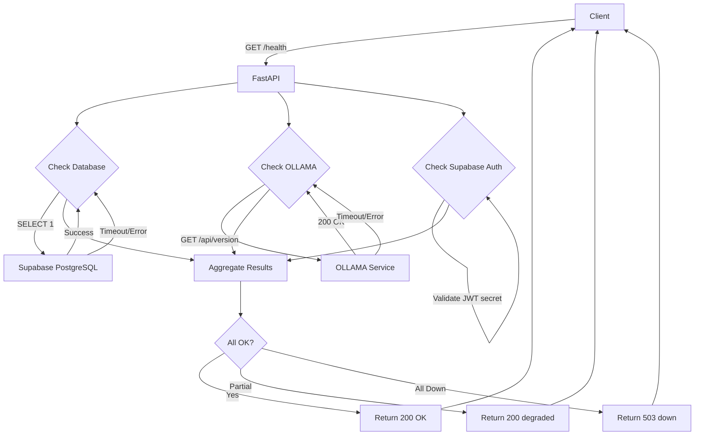

# 1. GET /health - Health Check

**Endpoint:** `GET /health`  
**Typ:** System Health Check  
**Autentykacja:** Nie wymagana (publiczny)  
**Złożoność:** Niska  
**Szacowany czas implementacji:** 2-3 godziny

---

## 1.1. Przegląd punktu końcowego

Endpoint monitorujący dostępność i stan systemu. Sprawdza połączenia z kluczowymi serwisami (Supabase, OLLAMA, Supabase Auth) i zwraca ich status. Używany przez systemy monitoringu, load balancery i DevOps do health checks.

**Charakterystyka:**
- **Publiczny** (bez autentykacji)
- **Wysoka dostępność** (musi działać nawet przy częściowej awarii)
- **Szybki** (<100ms)
- **Idempotentny**

---

## 1.2. Szczegóły żądania

- **Metoda HTTP:** `GET`
- **Struktura URL:** `/health`
- **Parametry:**
  - Wymagane: Brak
  - Opcjonalne: Brak
- **Request Body:** Brak
- **Headers:** Brak wymaganych

**Przykład wywołania:**
```bash
curl http://localhost:8000/health
```

---

## 1.3. Wykorzystywane typy

### Pydantic Models (Backend)

```python
# backend/models/health.py
from pydantic import BaseModel
from typing import Literal
from datetime import datetime

ServiceStatus = Literal["ok", "degraded", "down"]

class ServiceHealthStatus(BaseModel):
    database: ServiceStatus
    ollama: ServiceStatus
    supabase_auth: ServiceStatus

class HealthResponse(BaseModel):
    status: ServiceStatus  # Overall system status
    version: str
    timestamp: datetime
    services: ServiceHealthStatus
```

### TypeScript Types (Frontend)

```typescript
// src/lib/types.ts (already defined)
export type ServiceStatus = "ok" | "degraded" | "down";

export interface HealthResponse {
  status: ServiceStatus;
  version: string;
  timestamp: string;
  services: {
    database: ServiceStatus;
    ollama: ServiceStatus;
    supabase_auth: ServiceStatus;
  };
}
```

---

## 1.4. Szczegóły odpowiedzi

### Sukces (200 OK)

```json
{
  "status": "ok",
  "version": "1.0.0",
  "timestamp": "2025-11-19T10:30:00Z",
  "services": {
    "database": "ok",
    "ollama": "ok",
    "supabase_auth": "ok"
  }
}
```

### Częściowa degradacja (200 OK - nadal działa)

```json
{
  "status": "degraded",
  "version": "1.0.0",
  "timestamp": "2025-11-19T10:30:00Z",
  "services": {
    "database": "ok",
    "ollama": "down",
    "supabase_auth": "ok"
  }
}
```

### Całkowita awaria (503 Service Unavailable)

```json
{
  "status": "down",
  "version": "1.0.0",
  "timestamp": "2025-11-19T10:30:00Z",
  "services": {
    "database": "down",
    "ollama": "down",
    "supabase_auth": "down"
  }
}
```

**Status codes:**
- `200 OK` - System działa (ok lub degraded)
- `503 Service Unavailable` - System nie działa (down)

---

## 1.5. Przepływ danych



**Szczegółowy przepływ:**

1. **Request received** → FastAPI odbiera żądanie GET /health
2. **Parallel checks** → Asynchroniczne sprawdzanie wszystkich serwisów:
   - **Database check:** `SELECT 1` query (timeout 2s)
   - **OLLAMA check:** `GET /api/version` (timeout 2s)
   - **Supabase Auth check:** Walidacja JWT_SECRET (local, instant)
3. **Aggregate results** → Zbieranie wyników wszystkich checków
4. **Determine overall status:**
   - Wszystkie `ok` → status: `ok`
   - Przynajmniej jeden `down` ale nie wszystkie → status: `degraded`
   - Wszystkie `down` → status: `down`
5. **Return response** → 200 OK (ok/degraded) lub 503 (down)

---

## 1.6. Względy bezpieczeństwa

### Autentykacja i Autoryzacja
- **Brak autentykacji** - endpoint publiczny
- **Uzasadnienie:** Health checks muszą działać bez logowania dla load balancerów

### Potencjalne zagrożenia i zabezpieczenia

1. **Information Disclosure:**
   - **Zagrożenie:** Ujawnienie szczegółów infrastruktury (wersje, nazwy serwisów)
   - **Mitygacja:** 
     - Nie zwracaj szczegółowych wersji serwisów
     - Nie ujawniaj adresów IP/hostów
     - Ogranicz informacje w środowisku produkcyjnym

2. **DDoS Attack Vector:**
   - **Zagrożenie:** Endpoint może być używany do DDoS (sprawdzanie serwisów)
   - **Mitygacja:**
     - Rate limiting: 60 req/min per IP
     - Krótkie timeouty (2s) dla checków
     - Caching wyników (5s TTL)

3. **Timing Attacks:**
   - **Zagrożenie:** Analiza czasu odpowiedzi może ujawnić stan systemu
   - **Mitygacja:** Równoczesne sprawdzanie wszystkich serwisów (asyncio.gather)

---

## 1.7. Obsługa błędów

### Scenariusze błędów

| Scenariusz | Status Code | Response | Akcja |
|------------|-------------|----------|-------|
| Wszystkie serwisy działają | 200 OK | status: "ok" | Brak akcji |
| OLLAMA nie odpowiada | 200 OK | status: "degraded", ollama: "down" | Alert dla DevOps |
| Database timeout | 200 OK | status: "degraded", database: "down" | Alert CRITICAL |
| Wszystkie serwisy down | 503 Service Unavailable | status: "down" | Alert CRITICAL + Incident |
| Nieoczekiwany błąd wewnętrzny | 500 Internal Server Error | Standard error response | Log błędu + Alert |

---

## 1.8. Wydajność

### Cele wydajnościowe
- **Response time:** <100ms (p95)
- **Timeout:** 2s per service check
- **Throughput:** 100 req/s
- **Availability:** 99.9%

### Optymalizacje

1. **Parallel Checks:** `asyncio.gather()` dla wszystkich checków
2. **Response Caching:** Cache wyników na 5 sekund
3. **Short Timeouts:** 2s limit per service
4. **Connection Pooling:** Używaj istniejących connection pools

---

## 1.9. Kroki implementacji

### Krok 1: Utworzenie modeli Pydantic

**Plik:** `backend/models/health.py`

```python
from pydantic import BaseModel
from typing import Literal
from datetime import datetime

ServiceStatus = Literal["ok", "degraded", "down"]

class ServiceHealthStatus(BaseModel):
    database: ServiceStatus
    ollama: ServiceStatus
    supabase_auth: ServiceStatus

class HealthResponse(BaseModel):
    status: ServiceStatus
    version: str
    timestamp: datetime
    services: ServiceHealthStatus
```

### Krok 2-9: Zobacz pełny kod w [api-plan.md](../api-plan.md) sekcja 3.1

---

## 1.10. Checklist implementacji

- [ ] Utworzyć modele Pydantic (`models/health.py`)
- [ ] Zaimplementować service checkers (`services/health_check.py`)
- [ ] Utworzyć endpoint GET /health w FastAPI
- [ ] Dodać funkcję RPC w Supabase (`health_check()`)
- [ ] Skonfigurować zmienne środowiskowe
- [ ] Napisać testy jednostkowe
- [ ] Dodać rate limiting (produkcja)
- [ ] Skonfigurować monitoring i alerting
- [ ] Przetestować z rzeczywistymi serwisami
- [ ] Zweryfikować dokumentację OpenAPI

---

**Powrót do:** [Index](../api-implementation-index.md)

